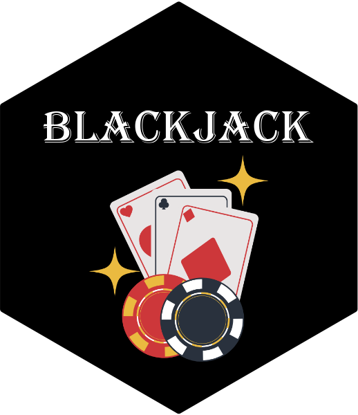

<!-- README.md is generated from README.Rmd. Please edit that file -->

```{r, include = FALSE}
knitr::opts_chunk$set(
  collapse = TRUE,
  comment = "#>",
  fig.path = "man/figures/README-",
  out.width = "100%"
)
```

# Blackjack 

This package provides a simple implementation of a Blackjack game with functionalities for card dealing, scoring, splitting hands, doubling down, insurance betting, and more. It allows players to interactively play a round of Blackjack with multiple players.

## Installation
You can install the package from [GitHub](https://github.com/MonashARP/game-package-wallabies.git) by either:

1. Cloning the repository to your local machine:
```{r, eval = FALSE}
git clone git@github.com:MonashARP/game-package-wallabies.git
```

2. Or downloading the ZIP file from GitHub and extracting it to a local folder. Then run:

```{r, eval = FALSE}
# Install devtools if you haven't already
install.packages("devtools")

library(devtools)

devtools::install()

```


